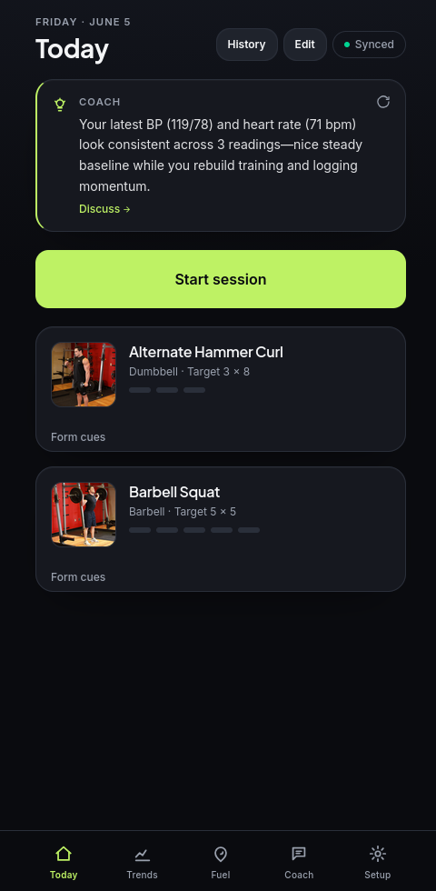
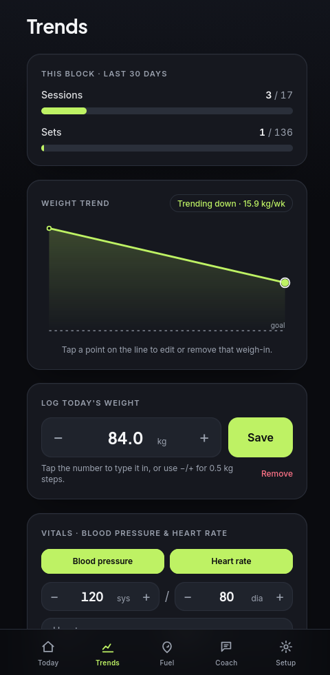
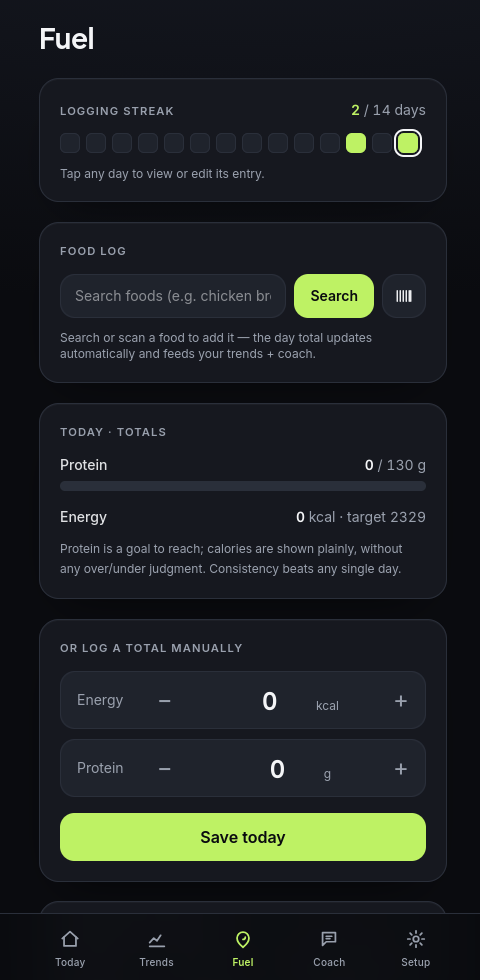
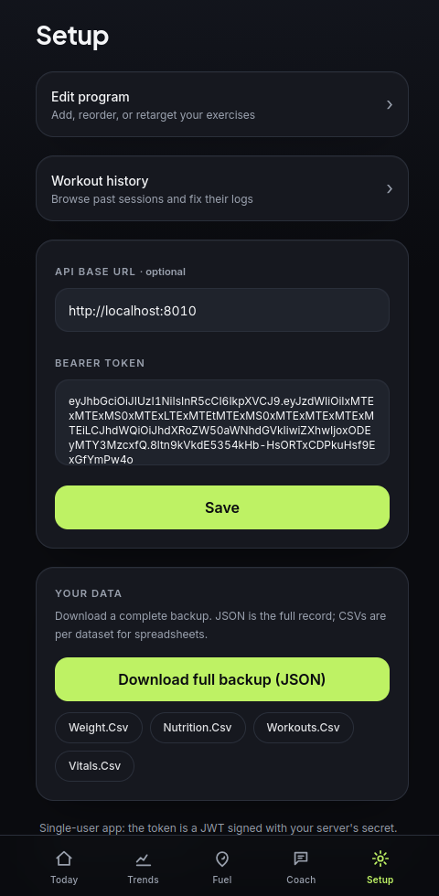

# Gym Coach

A personal weight-loss training app: log your workouts, nutrition, and vitals, and get an
**AI coach that reads your actual data**, adapts your plan through a deterministic safety
gate, reviews each week, and surfaces a proactive "here's what I noticed" — all on an
installable, offline-capable PWA. It runs entirely on one machine and is served to the
phone privately over Tailscale.

<table>
  <tr>
    <td align="center"><br><sub><b>Today</b><br>log sets · coach insight</sub></td>
    <td align="center"><br><sub><b>Trends</b><br>weight + vitals</sub></td>
    <td align="center"><br><sub><b>Fuel</b><br>food DB + macros</sub></td>
    <td align="center"><br><sub><b>Coach</b><br>grounded chat</sub></td>
    <td align="center"><br><sub><b>Setup</b><br>program · export</sub></td>
  </tr>
</table>

## What it does

- **Today** — start a session and log sets with typeable weight/reps; edit or remove a
  logged set in place; add exercises ad-hoc; a **proactive coach note** ("your latest BP
  119/78 and HR 71 look steady…") you can tap to discuss.
- **Trends** — adherence bars, a weight chart where you **tap a point to edit/remove** that
  weigh-in, and a **vitals card** (blood pressure + heart rate, many per day, with sparklines).
- **Fuel** — **food-database logging**: search [Open Food Facts](https://openfoodfacts.org),
  **scan a barcode**, or re-tap a recent food; portions in grams or servings. A macro summary
  shows protein as a goal to hit and calories *without* over/under judgment (wellbeing-first).
- **Coach** — chat grounded in your real logs (it calls read tools before it claims progress),
  proposes plan/target changes through a **safety gate** (it never writes directly), keeps
  multi-chat history, sees your vitals, and posts a **weekly review**.
- **Setup** — edit your program, browse/fix workout **history**, and **export a full backup**
  (JSON + per-dataset CSV).

## How it's built

- **Backend** (`coach/`) — FastAPI + a LangGraph coach agent + a **deterministic safety layer**
  (calorie floors, ED-history blocks, content screening — in code, not the prompt) + Postgres
  (asyncpg). RAG (pgvector) and an LLM-as-judge eval harness included.
- **Frontend** (`web/`) — Next.js 15 PWA (Node 20), offline write-queue, installable.
- **LLM** — chat on **GPT-5.5 via a local CLI proxy** (subscription-backed, OpenAI-compatible);
  **embeddings** via a **LiteLLM → Ollama** gateway (local `mxbai-embed-large`, free).
- **Knowledge** — a cited RAG corpus from openly-licensed sources (CDC, NHS, MedlinePlus,
  OpenStax), governance-gated.

> **New here (human or agent)?** Read [`docs/SYSTEM_OVERVIEW.md`](docs/SYSTEM_OVERVIEW.md) —
> the full architecture, services/ports, LLM wiring, phone deploy, and an operations cookbook.
> Then [`CLAUDE.md`](CLAUDE.md) for the architectural + safety invariants.
>
> Product/readiness notes:
> [`docs/product-capability-review-2026-06-06.md`](docs/product-capability-review-2026-06-06.md),
> [`docs/product-readiness-review-2026-06-05.md`](docs/product-readiness-review-2026-06-05.md),
> [`docs/engineering-review-2026-06-05.md`](docs/engineering-review-2026-06-05.md).

## Run it locally

```bash
pip install -r requirements.txt
./dev_up.sh                                   # Postgres + migrations (PG 16 + pgvector)
cp .env.example .env                          # fill in COACH_DB_URI, SUPABASE_JWT_SECRET, and
                                              # the LLM env (OPENAI_BASE_URL/KEY -> your proxy)
set -a; . ./.env; set +a

uvicorn coach.service:app --port 8010         # backend
cd web && npm install && npm run build && npm run start -- --port 3010   # frontend (Node 20)

python mint_token.py <user-uuid>              # bearer token for the Setup tab
```

Open `http://localhost:3010`, go to **Setup**, paste the token (the API URL is automatic),
and onboard. Without an LLM configured, logging works and coach endpoints return 503.

For the production setup on this machine (systemd services, auto-restart, nightly backup,
weekly review) see [`deploy/README.md`](deploy/README.md).

## On your phone

Served **tailnet-only** over HTTPS via Tailscale Serve — private to your devices, no public
exposure, no credentials in the JS bundle (token entered once on-device). Full steps:
[`deploy/PHONE_ACCESS.md`](deploy/PHONE_ACCESS.md).

## Tests

```bash
python -m pytest coach/tests -q                                  # no DB/LLM needed
COACH_DB_URI=... COACH_SEED_DIR=... python -m coach.smoke_test   # repo vs live PG
COACH_DB_URI=... COACH_SEED_DIR=... python -m coach.e2e_test     # full slice vs live PG
```

## Safety & licensing

This is health-adjacent. Safety thresholds are **evidence-aligned** to CDC/NHS guidance and
documented, but a **clinician must sign off** before any real launch —
see [`deploy/SAFETY_REVIEW.md`](deploy/SAFETY_REVIEW.md). Exercise catalog from
[free-exercise-db](https://github.com/yuhonas/free-exercise-db) (public domain). Personal
project — review licensing before any public distribution.
