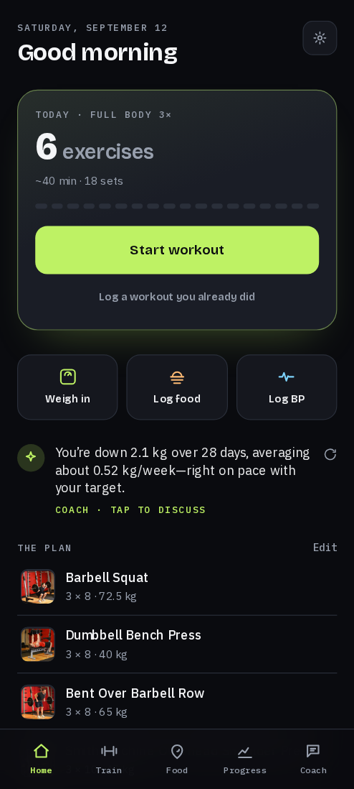
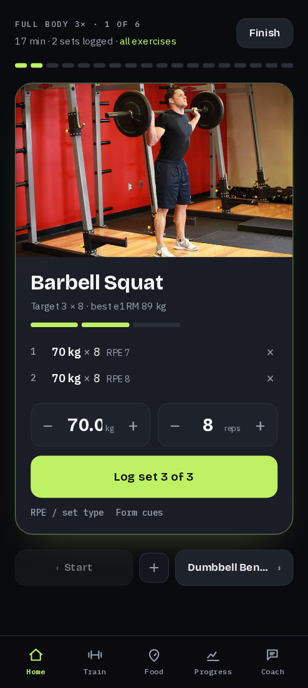
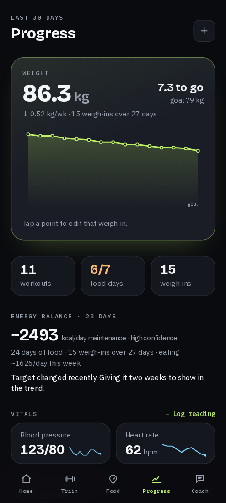
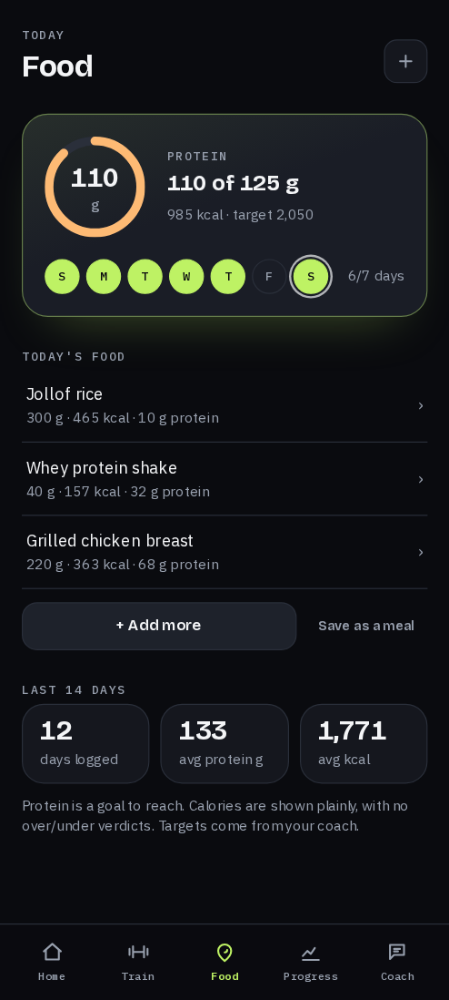
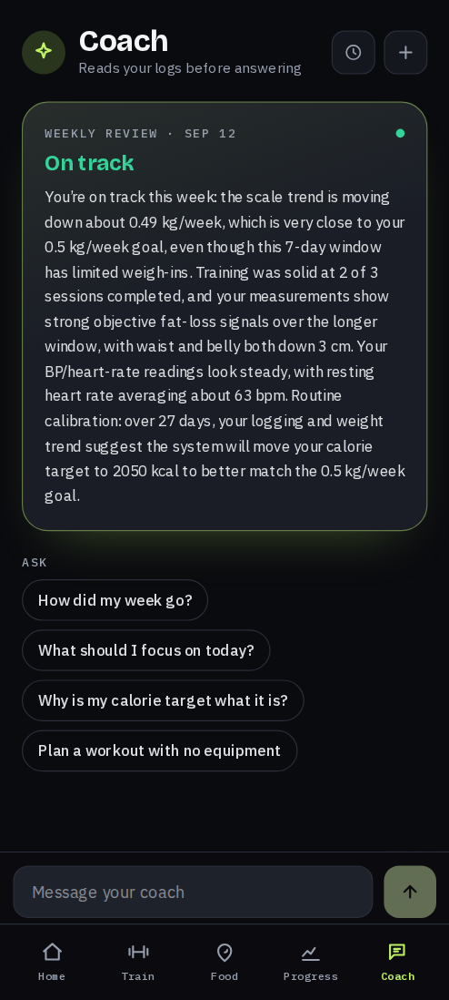
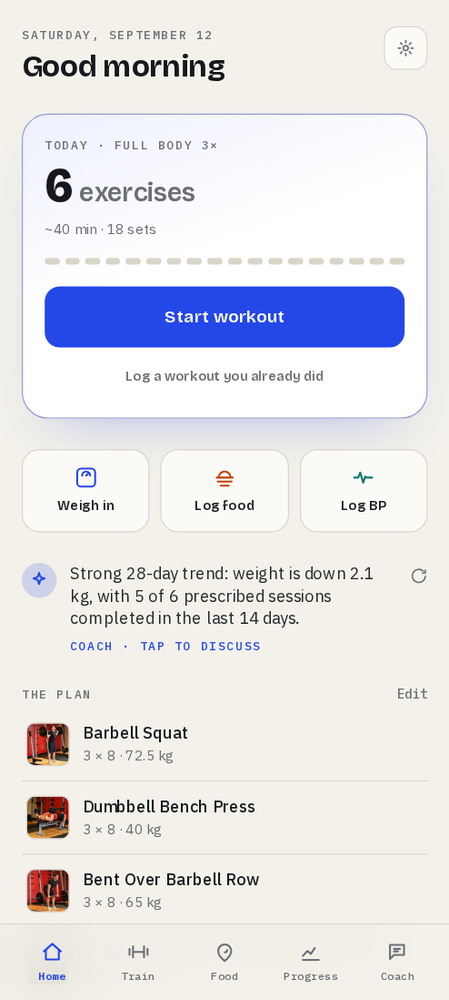
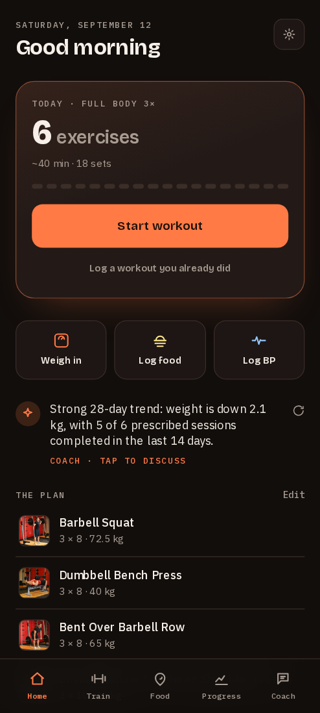
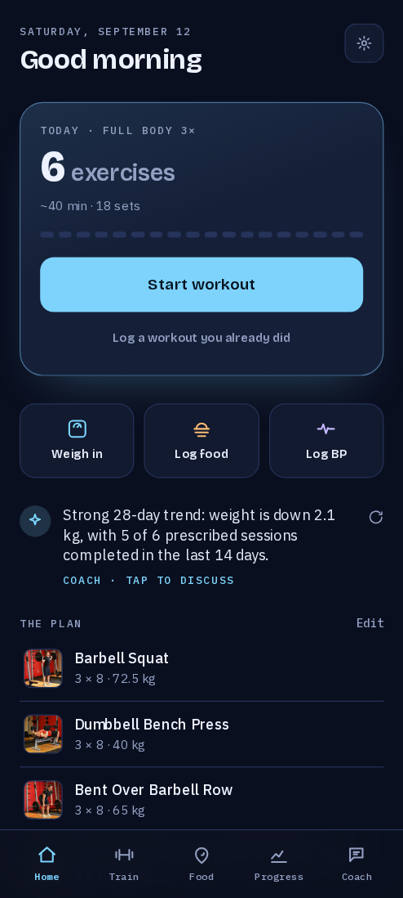
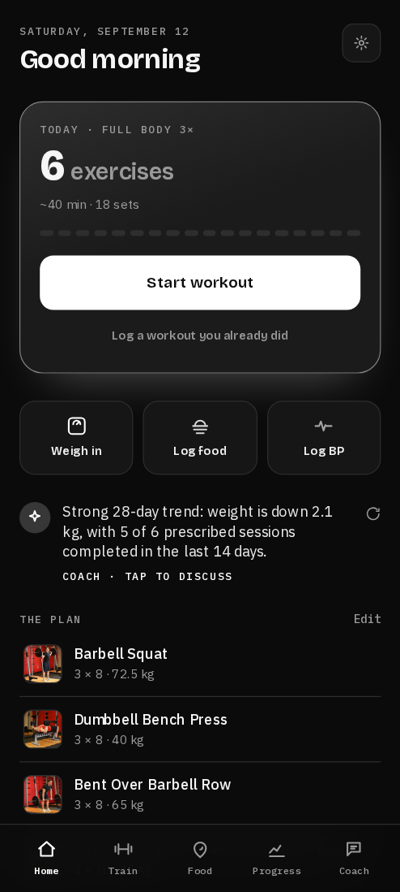
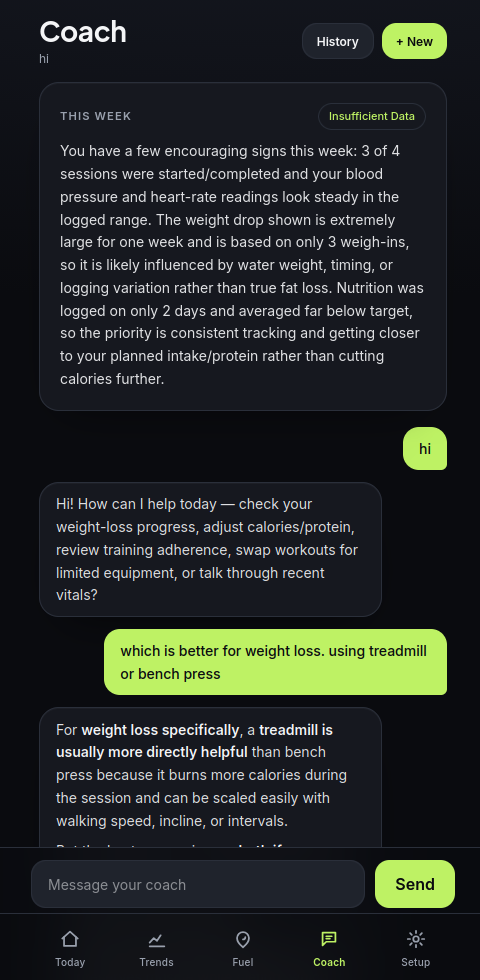

# Gym Coach

**A private AI coach over your own training data.** Log workouts, food, weight and vitals;
get a coach that reads your actual logs before it says anything, recalibrates your calorie
target from a deterministic energy-balance engine, reviews every week, and can never write to
your data without passing a safety gate. It runs entirely on one machine and reaches your
phone privately over Tailscale — as an installable PWA or a sideloaded Android app.

> [!IMPORTANT]
> **Not medical advice, and not clinically reviewed.** This is one person's project, built for
> their own use. It estimates calorie targets from your logs. The thresholds are aligned to
> public CDC and NHS guidance and the safety rules live in code rather than in a prompt, but
> **no clinician has signed off on any of it** (see
> [`deploy/SAFETY_REVIEW.md`](deploy/SAFETY_REVIEW.md)). Don't use it to make decisions about
> your health without talking to a professional, and don't deploy it for anyone else without a
> qualified review first. If you have a history of disordered eating, note that the app will
> disable automated calorie targets when you say so during setup.

<table>
  <tr>
    <td align="center"><br><sub><b>Home</b><br>today's workout · quick logs</sub></td>
    <td align="center"><br><sub><b>Workout</b><br>one lift at a time</sub></td>
    <td align="center"><br><sub><b>Progress</b><br>trend · energy balance</sub></td>
    <td align="center"><br><sub><b>Food</b><br>protein goal · meals</sub></td>
    <td align="center"><br><sub><b>Coach</b><br>weekly review</sub></td>
  </tr>
</table>

<sub>Screens shown with seeded demo data, not real user logs.</sub>

**Five looks, switchable in Setup** — the whole UI is CSS-variable tokens, so a look is a
palette swap, not a re-skin:

<table>
  <tr>
    <td align="center"><br><sub>Volt</sub></td>
    <td align="center"><br><sub>Paper</sub></td>
    <td align="center"><br><sub>Ember</sub></td>
    <td align="center"><br><sub>Glacier</sub></td>
    <td align="center"><br><sub>Mono</sub></td>
  </tr>
</table>

## What it does

**Home** — the day, not a database. Today's workout is one object (exercise count, estimated
minutes, set progress, one button); three tiles open bottom sheets for a weigh-in, food or a
blood-pressure reading; the coach says one grounded line you can tap to discuss.

**Workout** — a player, not a list. One exercise at a time with a looping demo, the target and
your best estimated 1RM, two big number fields, one **Log set** button, then the rest timer
takes the screen. Swipe through the session, flag PRs as they happen, finish with a summary
(sets, exercises, minutes, volume, PRs). Cardio logs time, distance and treadmill incline
instead of weight × reps.

**Progress** — the weight line is the hero, with an honest rate (no kg/week figure until 4+
weigh-ins across 2+ weeks) and distance to goal. Below it: the week in three tiles, the
**energy-balance estimate** with its confidence, vitals with sparklines, and body measurements
and progress photos as sections. Every log opens as a sheet; no form sits on the screen.

**Food** — today's meals first, protein as a ring to close, calories stated plainly with no
over/under verdict. One sheet adds food by [Open Food Facts](https://openfoodfacts.org)
search, barcode scan, a photo of the plate, a recent food, a saved meal, or a day total.

**Coach** — chat grounded in your logs. It calls read tools before making a claim, shows the
exact figures it used as **evidence chips**, and proposes target or program changes through a
safety gate rather than writing them. It also posts a verdict-first weekly review.

<p align="center"><br><sub>Every data claim carries the figures behind it.</sub></p>

**Train** — a program library you can run several routines from in parallel, each with its own
weekday schedule; a drag-to-reorder editor; workout history you can correct. Programs come
from curated templates, or the coach designs one from a goal in your words ("stronger back,
3 days a week").

**Also** — a five-step first-run wizard (it opens by letting you pick a look), a cited knowledge endpoint over a vetted corpus, daily
reminders, offline logging with a replay queue, full data export, and Health Connect import on
the Android build.

## The interesting part: safety and who owns the numbers

This is health-adjacent software, so the model is deliberately not in charge.

- **The LLM proposes; the system disposes.** The agent only calls read tools and `propose_*`
  tools that *stage* a typed change. Only the `safety` → `commit` graph nodes write. Writes are
  unreachable from the model.
- **Calorie targets are owned by a deterministic engine** ([`coach/adaptive.py`](coach/adaptive.py)).
  It derives your real maintenance from logged intake and your weight slope
  (`intake − slope × 7700`), blends that with a Mifflin-St Jeor anchor by how much data backs
  it, and only then suggests a target — floored, capped to ±10% per step, dead-banded at
  100 kcal, with a 14-day cooldown. Thin data or intake that looks under-logged returns *hold*,
  never a cut. The weekly review applies only this engine's verdict; the coach explains it.
- **Floors, rate caps and screening live in code**, not the prompt
  ([`coach/safety.py`](coach/safety.py)): calorie floors, a capped weekly loss rate, and
  inbound/outbound content screening that routes disordered-eating, self-harm, extreme-deficit
  and train-through-injury signals to support instead of optimised advice.
- **Disclosing a history of disordered eating disables automated calorie targets entirely** —
  onboarding writes no target, the coach refuses changes, the engine reports `disabled`.
- **No screen ever suggests a calorie or macro number.** Targets come only from onboarding, the
  engine or the coach.
- **Target history is append-only** at the database level, so every change keeps its rationale.

## How it's built

- **Backend** ([`coach/`](coach)) — FastAPI, a LangGraph agent
  (`hydrate → screen → agent → tools → safety → commit → guard`), the deterministic safety and
  adaptive-target layers, Postgres via asyncpg, a pgvector RAG pipeline, and an LLM-as-judge
  eval harness.
- **Frontend** ([`web/`](web)) — Next.js 15 App Router PWA on Node 20. A token design system
  (five looks, a fixed type scale in Bricolage Grotesque / IBM Plex Sans / IBM Plex Mono, sheet
  and ring primitives), an IndexedDB write queue that replays on reconnect, and a Capacitor
  Android shell for Health Connect.
- **LLM** — a ranked **failover chain** (`coach/llm.py`: gpt-5.5 → claude-sonnet-5 →
  gemini-3.8-flash) through a local OpenAI-compatible CLI proxy (subscription-backed, no per-token
  cost). It remembers provider cooldowns, skips rate-limited models instantly, and when every model
  is out the app says when the coach is back. **Embeddings** go through a **LiteLLM → Ollama**
  gateway running `mxbai-embed-large` locally.
- **Knowledge** — 257 chunks from openly-licensed sources (CDC, NHS, MedlinePlus, OpenStax),
  governance-gated, answers always cited.

> **New here, human or agent?** Read [`docs/SYSTEM_OVERVIEW.md`](docs/SYSTEM_OVERVIEW.md) — the
> whole running system: architecture, ports, services, LLM wiring, phone deploy, operations
> cookbook. Then [`CLAUDE.md`](CLAUDE.md) for the invariants you must not break, and
> [`docs/ROADMAP.md`](docs/ROADMAP.md) for what's shipped and what's next.

## Run it locally

```bash
pip install -r requirements.txt
./dev_up.sh                          # Postgres 16 + pgvector, creates coachdb, runs migrations
cp .env.example .env                 # COACH_DB_URI, SUPABASE_JWT_SECRET, and the LLM env
python -c "import secrets; print(secrets.token_hex(32))"   # -> SUPABASE_JWT_SECRET (required;
                                     # the service refuses to start without one)
set -a; . ./.env; set +a

uvicorn coach.service:app --port 8010                   # backend
cd web && npm install && npm run build && npm start      # frontend on :3000 (Node 20)
```

Then mint a token and open the app:

```bash
python mint_token.py <user-uuid>     # prints a bearer token
```

Open the site, go to **Setup → Signed in**, paste the token (leave the server URL blank — the
frontend proxies the API on the same origin), and the first-run wizard takes it from there.
Without an LLM configured, logging works normally and coach endpoints return 503.

For the always-on setup on this machine (systemd units, weekly review, nightly backup) see
[`deploy/README.md`](deploy/README.md).

## On your phone

Served **tailnet-only** over HTTPS by Tailscale Serve — private to your own devices, nothing
public, no credentials in the JS bundle. Run **`python pair.py`** and scan three QR codes: install
the Android app, subscribe to push notifications, and sign in. The app is a thin native shell
around the live site (so UI updates need no reinstall) with Health Connect auto-sync, home-screen
shortcuts and notification taps that open the right screen. The server reaches you through a
self-hosted **ntfy**: the weekly review, a calm morning nudge, and an alert if a job fails. Steps:
[`deploy/PHONE_ACCESS.md`](deploy/PHONE_ACCESS.md), [`deploy/ANDROID_APP.md`](deploy/ANDROID_APP.md),
[`deploy/NOTIFICATIONS.md`](deploy/NOTIFICATIONS.md); post-install checklist:
[`deploy/DEVICE_SMOKE.md`](deploy/DEVICE_SMOKE.md).

## Tests

```bash
python -m pytest coach/tests -q                 # 117 unit/integration tests, no DB or LLM needed
COACH_DB_URI=... python -m pytest coach/tests -q    # +8 DB integration tests (throwaway user)
cd web && npm test                              # Vitest: offline queue, QR pairing, deep links
cd web && TK=$(python ../mint_token.py <uuid> | awk '/token:/{print $2}') npm run test:e2e
                                                # Playwright: read-only pass over every screen
COACH_DB_URI=... COACH_SEED_DIR=... python -m coach.smoke_test   # data layer vs live Postgres
COACH_DB_URI=... COACH_SEED_DIR=... python -m coach.e2e_test     # full slice, scripted model
```

CI runs pytest, Vitest and a production `next build` on every push.

## Running it yourself

It is built to run on **one machine you control**, reachable over a private network. There is
no multi-tenant isolation beyond the JWT boundary and no rate limiting, so don't put it on the
open internet without an authenticating proxy in front. `SUPABASE_JWT_SECRET` is mandatory and
the service refuses to start without it. See [`SECURITY.md`](SECURITY.md) before you deploy.

## Licence and credits

Code is [MIT](LICENSE). The things it builds on keep their own terms:

| Source | Used for | Terms |
|---|---|---|
| [free-exercise-db](https://github.com/yuhonas/free-exercise-db) | the exercise catalog in `seed/` | public domain |
| [Open Food Facts](https://openfoodfacts.org) | food search and barcode lookup, at runtime | ODbL, attribution required |
| CDC, NHS, MedlinePlus, OpenStax | the knowledge corpus | public domain / Open Government Licence / CC BY |

The knowledge corpus itself is **not redistributed here** — `seed/rag_sources.json` lists the
sources with their licences, and the fetch script pulls them at build time, so attribution and
share-alike obligations stay with the original publishers.
